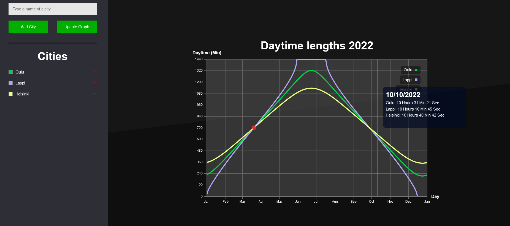

# CityDayLengthGraph
Laravel / Vue based project that draws a graph which shows daytime lengths of different cities.

___
## How to install
1. Install composer
2. Install node
3. Install php
4. Run "composer install"
5. Run "npm install"
6. Run "php artisan serve"

## How to use
1. Type a name of a city
2. Press add city
3. Repeat.
4. When you have all the cities, press "Update Graph"